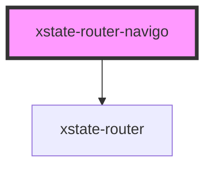

# xstate-router-navigo

<!-- Auto Generated Below -->

## Properties

| Property               | Attribute  | Description                                                                                                                                            | Type                                                                                                                                                                                                                                                                             | Default     |
| ---------------------- | ---------- | ------------------------------------------------------------------------------------------------------------------------------------------------------ | -------------------------------------------------------------------------------------------------------------------------------------------------------------------------------------------------------------------------------------------------------------------------------- | ----------- |
| `capture`              | `capture`  | Capture clicks from child elements and convert to routes                                                                                               | `boolean`                                                                                                                                                                                                                                                                        | `true`      |
| `componentRenderer`    | --         | Component renderer                                                                                                                                     | `(component: string, props?: ComponentProps<any, any, EventObject>) => Element \| Element[]`                                                                                                                                                                                     | `undefined` |
| `hash`                 | `hash`     | The hash parameter allows you to configure the hash character                                                                                          | `string`                                                                                                                                                                                                                                                                         | `'#'`       |
| `machine` _(required)_ | --         | An XState machine                                                                                                                                      | `StateMachine<any, any, EventObject>`                                                                                                                                                                                                                                            | `undefined` |
| `options`              | --         | Interpreter options                                                                                                                                    | `RouterInterpreterOptions`                                                                                                                                                                                                                                                       | `undefined` |
| `root`                 | `root`     | The main URL of your application.                                                                                                                      | `string`                                                                                                                                                                                                                                                                         | `undefined` |
| `routes`               | --         | Routes to register                                                                                                                                     | `{ [x: string]: string; }`                                                                                                                                                                                                                                                       | `undefined` |
| `stateRenderer`        | --         | State renderer                                                                                                                                         | `(component: Element \| Element[], state: State<any, EventObject>, send: (event: SingleOrArray<OmniEvent<EventObject>>, payload?: Record<string, any> & { type?: undefined; }) => State<any, EventObject>, service: Interpreter<any, any, EventObject>) => Element \| Element[]` | `undefined` |
| `useHash`              | `use-hash` | If useHash set to true then the router uses an old routing approach with hash in the URL. Fall back to this mode if there is no History API supported. | `boolean`                                                                                                                                                                                                                                                                        | `false`     |
| `useQs`                | `use-qs`   | Parse query string for params                                                                                                                          | `boolean`                                                                                                                                                                                                                                                                        | `true`      |

## Dependencies

### Depends on

- [xstate-router](../xstate-router)

### Graph

----------------------------------------------

*Built with [StencilJS](https://stenciljs.com/)*
