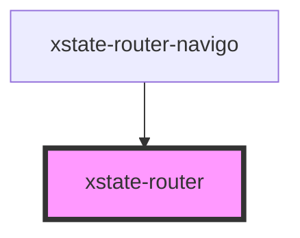

# xstate-router

<!-- Auto Generated Below -->

## Properties

| Property               | Attribute | Description                      | Type                                                                                                                                                                                                                                                                             | Default           |
| ---------------------- | --------- | -------------------------------- | -------------------------------------------------------------------------------------------------------------------------------------------------------------------------------------------------------------------------------------------------------------------------------- | ----------------- |
| `componentRenderer`    | --        | Component renderer               | `(component: string, props?: ComponentProps<any, any, EventObject>) => Element \| Element[]`                                                                                                                                                                                     | `renderComponent` |
| `machine` _(required)_ | --        | An XState machine                | `StateMachine<any, any, EventObject>`                                                                                                                                                                                                                                            | `undefined`       |
| `navigate`             | --        | Callback for url changes         | `(path: string, params?: Record<string, any>) => void`                                                                                                                                                                                                                           | `() => {}`        |
| `options`              | --        | Interpreter options              | `RouterInterpreterOptions`                                                                                                                                                                                                                                                       | `undefined`       |
| `route`                | --        | Callback for route subscriptions | `(routes: Route[]) => VoidFunction`                                                                                                                                                                                                                                              | `() => () => {}`  |
| `routes`               | --        | Routes to register               | `{ [x: string]: string; }`                                                                                                                                                                                                                                                       | `{}`              |
| `stateRenderer`        | --        | State renderer                   | `(component: Element \| Element[], state: State<any, EventObject>, send: (event: SingleOrArray<OmniEvent<EventObject>>, payload?: Record<string, any> & { type?: undefined; }) => State<any, EventObject>, service: Interpreter<any, any, EventObject>) => Element \| Element[]` | `undefined`       |

## Dependencies

### Used by

 - [xstate-router-navigo](../xstate-router-navigo)

### Graph

----------------------------------------------

*Built with [StencilJS](https://stenciljs.com/)*
